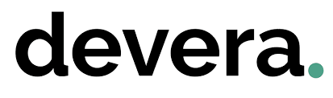

# Proyecto Devera 

<a href="https://www.devera.ai/es/">Devera</a> es una plataforma que automatiza mediante inteligencia artificial el <u>Análisis de Ciclo de Vida (ACV)</u> de productos, evaluando su huella de carbono desde la extracción de materias primas hasta su disposición final. Utiliza estándares internacionales como ISO 14040/44, ISO 14067 y el Protocolo de Gases de Efecto Invernadero (GHG Protocol).

En este proyecto grupal, en el que participan departamentos de **Fullstack, Data Science y Ciberseguridad**, diseñamos una aplicación web que permita transformar los datos del cliente en valor real y accionable, mediante un recorrido completo que va desde el registro hasta la visualización de informes.

## 🚀 Funcionalidades principales
- 🔐 Login y registro seguro

    - Autenticación por token JWT

    - Recuperación de contraseña


- 🤖 Onboarding inteligente

    - Scraping de productos mediante URL
    - Implementación de formulario para procesamiento de datos

- 📊 Dashboard de productos

    - Tabla de productos filtrable y exportable

    - Visualización de indicadores clave (Huella CO₂, Impact Score, etc.)


- 📋 Detalle completo del producto

    - Visualización modular con desgloses

    - Exportación de informe en PDF


## 🖥️ Tecnologías utilizadas

- Frontend con React
- Backend con Node.js y Express
- Base de datos con PostgreSQL
- Despliegues: Render, Netlify y Docker

## 📁 Estructura del proyecto

```hash
📁 client
📁 node_modules
📁 server
├── 💸.env.example  
├── 😶‍🌫️.gitignore
├── {} package-lock.json
├── {} package.json
└── 📖 README.MD
```

## 📦 Instalación y ejecución

1. 🔱 Fork + 👬🏻 clone del repositorio
2. Instala dependencias en la raíz del proyecto y en las carpetas client y server:
```hash
npm i
cd client && npm i
cd server && npm i
```
3. Ejecuta backend y frontend
```hash
cd server
npm run dev

cd client
npm run dev
```

## 🌐 URLs del Proyecto

### 🚀 Producción
- 🖥️ **Frontend (Netlify):** [https://deveraai.netlify.app/login](https://deveraai.netlify.app/login)
- 🛠️ **Backend (Render):** [https://devera-backend.onrender.com/ready](https://devera-backend.onrender.com/ready)

### 🧪 Desarrollo local
- 🖥️ **Frontend:** [http://localhost:5173](http://localhost:5173)
- 🛠️ **Backend:** [http://localhost:3000](http://localhost:3000)

## ⛩️ Diagrama de arquitectura


## 🎓 Equipo de desarrollo

- 📲 **Full Stack**: Jonathan Morán, Mario L. Clavero, Michelle A. Díaz y Pablo Bacigalupe.

- 🛢️ **Data Science**: Cristian Vásquez, Eric Castro, Juan de la Fuente Larrocca, Karla Rojas y Rafa Cercos Matas.

- 🔐 **Ciberseguridad**: Claudia Mateos, David Maroto, Dennyse Duma y Joel Cabrera.

<br>



## 📚 Documentación del Proyecto

### 🖥️ Frontend  
Para conocer todos los detalles de instalación, estructura y uso del cliente web, consulta el siguiente enlace:  
🔗 [Leer README del Frontend](./client/README.md)

### 🛠️ Backend  
Para configuración, rutas, y demás aspectos técnicos del servidor, visita:  
🔗 [Leer README del Backend](./server/README.md)